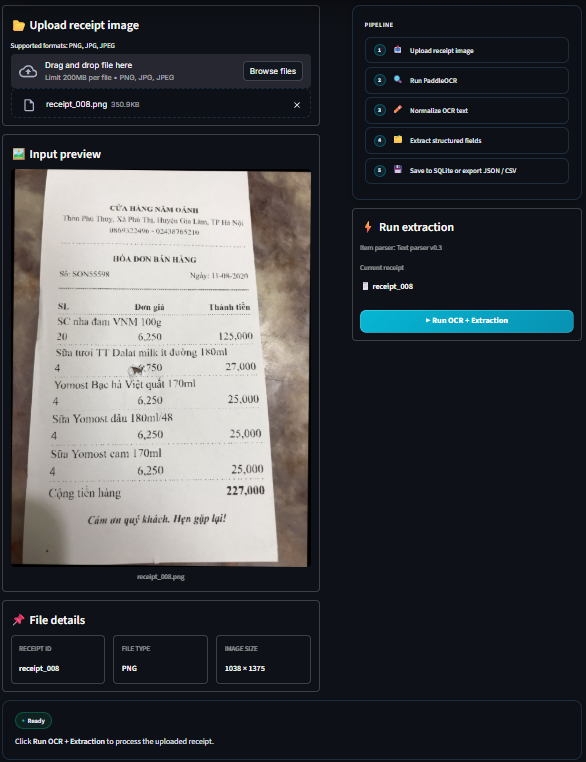
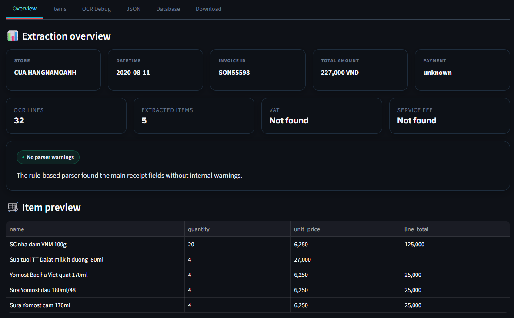
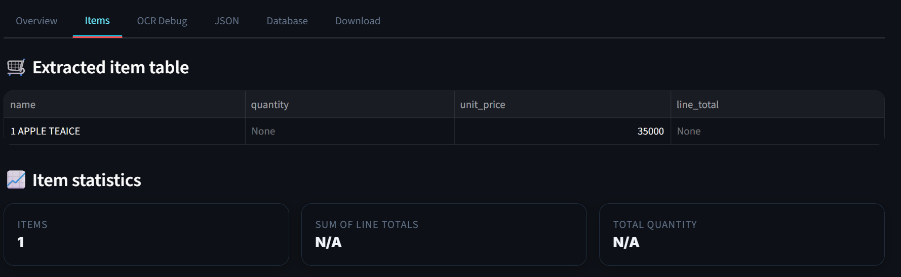
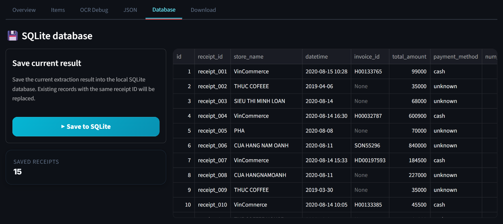
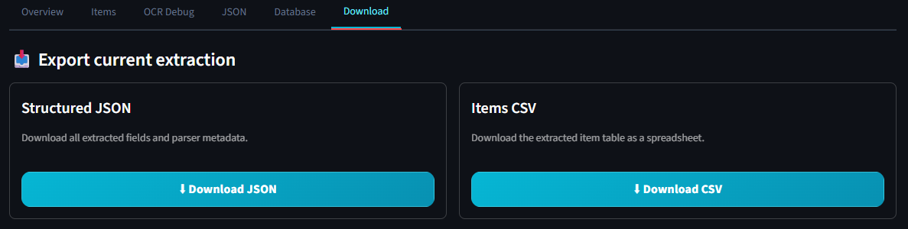

# Vietnamese Receipt/Invoice OCR & Information Extraction System

An end-to-end OCR and information extraction system for Vietnamese receipts and invoices.

The system takes a receipt image as input, runs OCR, extracts structured receipt fields, displays the result in a Streamlit UI, saves records to SQLite, and supports JSON/CSV export.

## Demo

### Upload and receipt preview



### Extraction overview



### Extracted item table



### SQLite database view



### JSON/CSV export



## Features

* Upload Vietnamese receipt/invoice images.
* Run OCR using PaddleOCR.
* Extract structured receipt information with a rule-based parser.
* Normalize common OCR recognition errors.
* Extract receipt-level fields and item-level fields.
* Display raw OCR text for debugging.
* Display structured JSON output.
* Display extracted item table.
* Format numeric values in Streamlit tables for better readability.
* Save extraction results to SQLite.
* Export receipt-level and item-level data to JSON/CSV.
* Evaluate extraction quality against manually created ground truth labels.
* Inspect OCR bounding boxes for layout-level debugging.
* Optionally apply OCR text correction to store names and item names.
* Run a layout-aware item parser candidate using OCR bounding-box rows.
* Switch item parser mode directly in the Streamlit sidebar.

## Extracted Fields

The current parser extracts:

* store name / seller name
* date and time
* invoice ID / receipt code
* item list
* quantity
* unit price
* line total
* VAT / service fee, if available
* total amount
* payment method

## Tech Stack

| Component              | Technology                                     |
| ---------------------- | ---------------------------------------------- |
| OCR                    | PaddleOCR                                      |
| Image handling         | Pillow, OpenCV                                 |
| Information extraction | Regex + rule-based parser                      |
| Layout-aware parsing   | OCR bounding-box row grouping                  |
| Text correction        | Rule-based OCR text correction                 |
| UI                     | Streamlit                                      |
| Database               | SQLite                                         |
| Data processing        | Pandas                                         |
| Evaluation             | Custom receipt-level and item-level evaluators |
| Language               | Python                                         |

## Project Structure

```text
vietnamese-receipt-ocr/
│
├── app/
│   └── streamlit_app.py
│
├── data/
│   ├── raw/
│   │   └── receipts/
│   ├── processed/
│   │   └── images/
│   ├── ocr_outputs/
│   ├── extracted_results/
│   ├── corrected_results/
│   ├── layout_extracted_results/
│   ├── ground_truth/
│   ├── evaluation/
│   └── sample/
│
├── database/
│
├── docs/
│   ├── screenshots/
│   ├── corrected_item_evaluation.md
│   ├── dataset_strategy.md
│   ├── devlog.md
│   ├── error_analysis.md
│   ├── item_level_evaluation.md
│   ├── layout_aware_item_evaluation.md
│   ├── layout_item_parser_experiment.md
│   ├── mvp_scope.md
│   └── release_notes_v0.4.md
│
├── notebooks/
│   └── 01_ocr_baseline.ipynb
│
├── receipt_ocr/
│   ├── __init__.py
│   ├── config.py
│   ├── database.py
│   ├── evaluator.py
│   ├── exporter.py
│   ├── image_preprocessor.py
│   ├── layout_item_parser.py
│   ├── ocr_engine.py
│   ├── ocr_text_corrector.py
│   ├── receipt_parser.py
│   ├── schema.py
│   └── text_normalizer.py
│
├── scripts/
│   ├── analyze_errors.py
│   ├── apply_text_correction.py
│   ├── batch_inspect_ocr_layout.py
│   ├── evaluate_corrected_items.py
│   ├── evaluate_extraction.py
│   ├── evaluate_items.py
│   ├── evaluate_layout_items.py
│   ├── export_db.py
│   ├── init_db.py
│   ├── inspect_error_context.py
│   ├── inspect_ocr_layout.py
│   ├── layout_item_parser_experiment.py
│   ├── load_extractions_to_db.py
│   ├── run_extraction.py
│   ├── run_layout_item_extraction.py
│   ├── run_ocr.py
│   └── summarize_layout_rows.py
│
├── tests/
│   ├── test_receipt_parser.py
│   └── test_text_normalizer.py
│
├── .gitignore
├── README.md
├── pyproject.toml
└── requirements.txt
```

## Pipeline

Default deterministic pipeline:

```text
Receipt image
→ PaddleOCR
→ Raw OCR text
→ Text normalization
→ Rule-based information extraction
→ Structured JSON
→ SQLite database
→ CSV/JSON export
→ Receipt-level evaluation
→ Item-level evaluation
```

Optional OCR text correction pipeline:

```text
Extracted JSON
→ Rule-based OCR text correction
→ Corrected JSON
→ Corrected item-name evaluation
```

Layout-aware item parser candidate pipeline:

```text
OCR JSON with bounding boxes
→ Layout row grouping
→ Item section detection
→ Layout-aware item parsing
→ Layout-aware extracted JSON
→ Layout-aware item evaluation
```

Streamlit app flow:

```text
Upload image
→ Select parser mode
→ Run OCR + extraction
→ Review overview / item table / OCR debug / JSON
→ Save to SQLite or download JSON/CSV
```

## Installation

Create a clean Python environment:

```powershell
conda create -n receipt-ocr python=3.10 -y
conda activate receipt-ocr
```

Install dependencies:

```powershell
pip install --upgrade pip setuptools wheel
pip install -r requirements.txt
```

Verify the OCR installation:

```powershell
python -c "import paddle; print('paddle:', paddle.__version__)"
python -c "from paddleocr import PaddleOCR; print('paddleocr import ok')"
```

## Usage

### 1. Run OCR on one image

```powershell
python scripts/run_ocr.py --image data/raw/receipts/receipt_001.png
```

Output:

```text
data/ocr_outputs/receipt_001_ocr.txt
data/ocr_outputs/receipt_001_ocr.json
```

### 2. Run OCR on all images

```powershell
python scripts/run_ocr.py --all
```

### 3. Run information extraction on one OCR text file

```powershell
python scripts/run_extraction.py --ocr-text data/ocr_outputs/receipt_001_ocr.txt
```

Output:

```text
data/extracted_results/receipt_001_extracted.json
```

### 4. Run information extraction on all OCR outputs

```powershell
python scripts/run_extraction.py --all
```

### 5. Initialize SQLite database

```powershell
python scripts/init_db.py
```

### 6. Load extracted JSON files into SQLite

```powershell
python scripts/load_extractions_to_db.py --all
```

### 7. Export database records to CSV

```powershell
python scripts/export_db.py
```

Output:

```text
data/extracted_results/receipts_export.csv
data/extracted_results/items_export.csv
```

### 8. Run receipt-level evaluation

```powershell
python scripts/evaluate_extraction.py --all
```

Output:

```text
data/evaluation/evaluation_report.csv
data/evaluation/evaluation_summary.json
```

### 9. Run default item-level evaluation

```powershell
python scripts/evaluate_items.py
```

Output:

```text
data/evaluation/item_evaluation_report.csv
data/evaluation/item_evaluation_summary.json
docs/item_level_evaluation.md
```

### 10. Generate error analysis report

```powershell
python scripts/analyze_errors.py
```

Output:

```text
docs/error_analysis.md
data/evaluation/error_buckets.csv
```

### 11. Inspect OCR layout boxes for one receipt

```powershell
python scripts/inspect_ocr_layout.py --receipt-id receipt_004
```

Output:

```text
data/evaluation/layout_debug/receipt_004_layout_lines.csv
data/evaluation/layout_debug/receipt_004_layout_annotated.png
```

### 12. Inspect OCR layout boxes for all receipts

```powershell
python scripts/batch_inspect_ocr_layout.py
```

Output:

```text
data/evaluation/layout_debug/receipt_001_layout_lines.csv
data/evaluation/layout_debug/receipt_001_layout_annotated.png
...
```

### 13. Summarize grouped layout rows

```powershell
python scripts/summarize_layout_rows.py
```

Output:

```text
data/evaluation/layout_debug/layout_row_summary.txt
```

### 14. Run layout-aware item extraction

Before running layout-aware item extraction, generate layout debug rows first:

```powershell
python scripts/batch_inspect_ocr_layout.py
```

Then run:

```powershell
python scripts/run_layout_item_extraction.py --all
```

Output:

```text
data/layout_extracted_results/receipt_001_layout_extracted.json
data/layout_extracted_results/receipt_002_layout_extracted.json
...
```

### 15. Evaluate layout-aware item extraction

```powershell
python scripts/evaluate_layout_items.py
```

Output:

```text
data/evaluation/layout_aware_item_evaluation_report.csv
data/evaluation/layout_aware_item_evaluation_summary.json
docs/layout_aware_item_evaluation.md
```

### 16. Apply optional OCR text correction

```powershell
python scripts/apply_text_correction.py --all
```

Output:

```text
data/corrected_results/receipt_001_corrected.json
data/corrected_results/receipt_002_corrected.json
...
```

### 17. Evaluate corrected item names

```powershell
python scripts/evaluate_corrected_items.py
```

Output:

```text
data/evaluation/corrected_item_evaluation_report.csv
data/evaluation/corrected_item_evaluation_summary.json
docs/corrected_item_evaluation.md
```

### 18. Run Streamlit app

```powershell
streamlit run app/streamlit_app.py
```

The app supports:

* receipt image upload
* OCR execution
* parser mode selection
* text parser v0.3
* layout parser v0.4
* structured JSON preview
* item table preview
* formatted numeric values in tables
* raw OCR text debugging
* SQLite save
* JSON/CSV download

## Streamlit Parser Modes

The Streamlit app supports two item parser modes:

| UI Label           | Internal Version                   | Description                                                 |
| ------------------ | ---------------------------------- | ----------------------------------------------------------- |
| Text parser v0.3   | `text_based_v0.3`                  | Stable default item parser based on OCR text order          |
| Layout parser v0.4 | `layout_aware_item_v0.4_candidate` | Layout-aware item parser candidate using OCR bounding boxes |

The default mode is:

```text
Text parser v0.3
```

The layout-aware parser is optional and can be selected from the sidebar.

## Evaluation

The current evaluation set contains:

* 15 Vietnamese receipt/invoice images
* 15 manually created ground truth JSON files
* 39 ground-truth item rows
* multiple receipt layouts, including retail, coffee shop, bookstore, restaurant, and small shop receipts

Current default parser version:

```text
rule_based_v0.3
```

Current layout-aware item parser candidate:

```text
layout_aware_item_v0.4_candidate
```

Current Streamlit UI milestone:

```text
v0.4-streamlit-layout-mode
```

### Receipt-level Evaluation

Receipt-level fields are evaluated using the default rule-based parser.

| Field          | Accuracy |
| -------------- | -------: |
| Store name     |   80.00% |
| Datetime       |   93.33% |
| Invoice ID     |   86.67% |
| Total amount   |   93.33% |
| Payment method |  100.00% |
| Items count    |  100.00% |
| Overall        |   92.22% |

### Default Item-level Evaluation

Default item extraction uses the text-based `rule_based_v0.3` parser.

| Item Field                  | Accuracy |
| --------------------------- | -------: |
| Item count                  |  100.00% |
| Item name                   |   84.62% |
| Quantity                    |   74.36% |
| Unit price                  |   97.44% |
| Line total                  |   94.87% |
| Overall item field accuracy |   87.82% |

### Layout-aware Item Evaluation

Layout-aware item extraction uses `layout_aware_item_v0.4_candidate`.

| Item Field                  | Accuracy |
| --------------------------- | -------: |
| Item count                  |  100.00% |
| Item name                   |  100.00% |
| Quantity                    |  100.00% |
| Unit price                  |  100.00% |
| Line total                  |  100.00% |
| Overall item field accuracy |  100.00% |

This result is measured on the current MVP evaluation set of 15 receipts and 39 item rows. It should be interpreted as a strong candidate result, not as production-level generalization.

### Parser Comparison

| Parser                             | Scope                              | Item Count | Item Name | Quantity | Unit Price | Line Total | Overall Item Field |
| ---------------------------------- | ---------------------------------- | ---------: | --------: | -------: | ---------: | ---------: | -----------------: |
| `rule_based_v0.3`                  | Default text-based parser          |    100.00% |    84.62% |   74.36% |     97.44% |     94.87% |             87.82% |
| `layout_aware_item_v0.4_candidate` | Layout-aware item parser candidate |    100.00% |   100.00% |  100.00% |    100.00% |    100.00% |            100.00% |

The default parser remains `rule_based_v0.3`.

The layout-aware parser is currently available as an optional Streamlit item parser mode and can also write separate outputs to:

```text
data/layout_extracted_results/
```

### Evaluation Artifacts

The project includes multiple evaluation layers.

```text
scripts/evaluate_extraction.py
```

Evaluates receipt-level fields such as store name, datetime, invoice ID, total amount, payment method, and item count.

```text
scripts/evaluate_items.py
```

Evaluates item-level fields from the default extraction output.

```text
scripts/evaluate_layout_items.py
```

Evaluates item-level fields from the layout-aware extraction output.

```text
scripts/evaluate_corrected_items.py
```

Evaluates raw item names versus corrected item names.

Generated local reports:

```text
data/evaluation/evaluation_report.csv
data/evaluation/evaluation_summary.json
data/evaluation/item_evaluation_report.csv
data/evaluation/item_evaluation_summary.json
data/evaluation/layout_aware_item_evaluation_report.csv
data/evaluation/layout_aware_item_evaluation_summary.json
data/evaluation/corrected_item_evaluation_report.csv
data/evaluation/corrected_item_evaluation_summary.json
```

These files are treated as local evaluation outputs and are not committed to Git.

## Key Findings

The final rule-based parser reached strong performance on the 15-receipt MVP dataset.

The largest improvements came from:

* invoice ID normalization for OCR variants such as `S6-31`, `S6-32`, `S6SON55598`, and `SHD:19810000682020`
* datetime parsing for compact OCR formats such as `04.10.202016.19` and `09:47:21-15/08r2020`
* conservative payment method detection to avoid false positives from words like `THE` and `CK`
* item filtering to remove metadata, address, summary, discount, and receipt header lines
* reversed temporary-bill item parsing for layouts where prices appear before item names
* OCR layout inspection to debug item extraction failures
* a targeted whitelist for product-code item names such as `CP_sudn gia heo 300g`

The strongest fields in the default rule-based parser are:

```text
payment_method : 100.00%
items_count    : 100.00%
unit_price     : 97.44%
line_total     : 94.87%
```

Remaining weaker fields in the default rule-based parser:

```text
store_name     : 80.00%
invoice_id     : 86.67%
quantity       : 74.36%
item_name      : 84.62%
```

The layout-aware item parser candidate improves item extraction by using OCR bounding-box row structure. On the current MVP dataset, it reaches 100.00% item-level accuracy across item count, name, quantity, unit price, and line total.

The remaining receipt-level errors are mostly caused by OCR recognition mistakes, spelling distortion, and layout variation.

## OCR Error Pattern

The current OCR engine can usually detect text regions correctly, but recognition errors still occur in Vietnamese text.

Examples:

```text
Dầu gội thảo dược  -> Dau goi thao dugc
Sườn già heo       -> sudn gia heo
Trả lại            -> Tra lgi
Tiền mặt           -> Tien mal
Thời gian          -> Thi gian
```

The current parser handles some OCR errors with deterministic normalization rules. Future work can add a stronger optional OCR text correction layer for item names and store names, while keeping numeric fields, dates, invoice IDs, and barcodes unchanged.

## Optional OCR Text Correction Experiment

This project includes an optional OCR text correction layer for improving the readability of extracted text fields.

The correction layer is intentionally conservative.

It only adds corrected text fields for:

* `store_name`
* `item.name`

It does not modify:

* invoice ID
* datetime
* quantity
* unit price
* line total
* total amount
* VAT / service fee
* barcode-like values

This design keeps the deterministic rule-based extraction pipeline stable while allowing text readability improvements as a post-processing step.

### Correction Pipeline

```text
Extracted JSON
→ Rule-based text correction
→ Corrected JSON
→ Corrected item-name evaluation
```

Correction output is saved separately under:

```text
data/corrected_results/
```

The original extraction output under `data/extracted_results/` is not overwritten.

### Correction Scripts

```text
scripts/apply_text_correction.py
```

Applies OCR text correction to extracted JSON files.

```text
scripts/evaluate_corrected_items.py
```

Compares raw item names and corrected item names against ground truth.

### Current Correction Result

On the current 39 item rows:

| Metric                             |   Value |
| ---------------------------------- | ------: |
| Raw item name accuracy             |  84.62% |
| Corrected item name accuracy       |  84.62% |
| Average raw similarity score       |  0.8463 |
| Average corrected similarity score |  0.8631 |
| Average score delta                | +0.0169 |
| Improved rows                      |      13 |
| Regressed rows                     |       0 |
| Unchanged rows                     |      26 |

The correction layer does not improve item-name accuracy yet, but it improves average text similarity and readability without causing regression on the current evaluation set.

This confirms that OCR text correction is useful as an optional post-processing layer, but the remaining item-name errors in the default parser are mostly caused by parser alignment issues rather than spelling mistakes alone.

## Layout-aware Item Parser Candidate

This project includes a layout-aware item parser candidate.

The layout-aware parser uses OCR bounding-box rows generated from PaddleOCR output. It is designed to improve item extraction by using visual row structure instead of relying only on raw OCR text order.

Current layout-aware parser version:

```text
layout_aware_item_v0.4_candidate
```

### Layout-aware Pipeline

```text
OCR JSON with bounding boxes
→ Layout row grouping
→ Item section detection
→ Layout-aware item parsing
→ Layout-aware extracted JSON
→ Layout-aware item evaluation
```

The layout-aware output is saved separately under:

```text
data/layout_extracted_results/
```

The default extraction output under `data/extracted_results/` is not overwritten.

### Layout-aware Scripts

```text
scripts/inspect_ocr_layout.py
```

Inspects OCR bounding boxes for a single receipt and generates row-level layout CSV/debug images.

```text
scripts/batch_inspect_ocr_layout.py
```

Runs layout inspection for all OCR JSON files.

```text
scripts/summarize_layout_rows.py
```

Creates a text summary of grouped OCR layout rows.

```text
scripts/run_layout_item_extraction.py
```

Creates layout-aware extraction JSON files by replacing item rows with layout-aware item parser output.

```text
scripts/evaluate_layout_items.py
```

Evaluates layout-aware item extraction results against ground truth.

### Current Layout-aware Result

On the current MVP evaluation set:

* 15 receipts
* 39 ground-truth item rows

| Item Field                  | Accuracy |
| --------------------------- | -------: |
| Item count                  |  100.00% |
| Item name                   |  100.00% |
| Quantity                    |  100.00% |
| Unit price                  |  100.00% |
| Line total                  |  100.00% |
| Overall item field accuracy |  100.00% |

This result shows that the layout-aware parser is a strong candidate for the next parser version. However, it is still treated as a candidate because it has only been validated on the current MVP dataset, not on a larger production-scale benchmark.

## Git Tags / Milestones

Current project milestones:

| Tag                           | Description                                                     |
| ----------------------------- | --------------------------------------------------------------- |
| `v1.0-mvp`                    | Initial Streamlit MVP release                                   |
| `v0.3-rule-based-parser`      | Rule-based parser v0.3 milestone                                |
| `v0.4-layout-aware-candidate` | Layout-aware item parser candidate                              |
| `v0.4-streamlit-layout-mode`  | Streamlit UI with parser mode selection and updated screenshots |

## Release Notes

* [v0.4 Streamlit Layout Parser Mode](docs/release_notes_v0.4.md)

## Data Privacy and Git Tracking

Private or local data is ignored by Git.

Ignored local data includes:

```text
data/raw/receipts/*
data/processed/images/*
data/ocr_outputs/*
data/extracted_results/*
data/corrected_results/*
data/layout_extracted_results/*
data/ground_truth/*
data/evaluation/*
data/dataset_manifest.csv
database/*.db
.tmp_streamlit/
docs/inspect_*.txt
```

Only placeholder `.gitkeep` files and documentation screenshots are committed.

## Limitations

* OCR recognition errors still affect item names and store names.
* The parser is rule-based and may not generalize to completely unseen receipt layouts.
* The current dataset is small and intended for MVP evaluation, not production benchmarking.
* Item-level matching currently uses order-based comparison.
* Store name extraction is still heuristic-based.
* Invoice ID extraction can still fail when OCR misreads the entire code or when the receipt has no explicit label.
* The default text-based parser still has weaker quantity and item-name performance than the layout-aware candidate.
* The optional OCR text correction layer improves readability and average similarity, but it does not improve item-name accuracy yet.
* The layout-aware parser candidate depends on OCR bounding boxes.
* The layout-aware parser has not yet been validated on a larger external dataset.
* Optional LLM/API correction is not part of the core deterministic pipeline yet.

## Roadmap

This project is not finished at the rule-based parser stage. The current version is a strong deterministic baseline, and future improvements should focus on OCR correction, layout awareness, and generalization.

Completed:

1. OCR baseline with PaddleOCR.
2. Rule-based receipt-level extraction.
3. Rule-based item extraction.
4. SQLite storage.
5. Streamlit demo UI.
6. CSV/JSON export.
7. Receipt-level evaluation.
8. Item-level evaluation.
9. Error analysis report.
10. OCR layout inspection utility.
11. Optional OCR text correction experiment.
12. Corrected item-name evaluation.
13. Layout-aware item parser experiment.
14. Layout-aware item parser candidate.
15. Layout-aware item-level evaluation.
16. Streamlit parser mode selection.
17. Numeric formatting in Streamlit tables.
18. Updated Streamlit screenshots.
19. v0.4 release notes.

Planned improvements:

1. Validate the layout-aware parser on more receipt formats.
2. Add more ground-truth labeled receipts.
3. Improve store name extraction.
4. Add OCR preprocessing experiments.
5. Improve optional OCR text correction using a larger correction dictionary or LLM-based correction.
6. Compare PaddleOCR with VietOCR.
7. Expand the evaluation dataset.
8. Add optional LLM-based structured parser for difficult receipts.
9. Add FastAPI backend for API serving.
10. Add Docker support.
11. Add fuzzy item alignment for item-level evaluation.

## Project Status

Current status:

```text
rule_based_v0.3 completed
optional OCR text correction experiment completed
layout_aware_item_v0.4_candidate completed
Streamlit layout parser mode completed
```

Current parser versions:

```text
default parser              : rule_based_v0.3
layout-aware item candidate : layout_aware_item_v0.4_candidate
```

Implemented:

* OCR baseline with PaddleOCR
* rule-based receipt-level extraction
* rule-based item extraction
* OCR text normalization
* invoice ID normalization
* datetime normalization
* payment method detection
* item-level evaluation
* OCR layout inspection utility
* optional OCR text correction
* corrected item-name evaluation
* layout-aware item parser candidate
* layout-aware item evaluation
* Streamlit parser mode selector
* formatted numeric values in Streamlit tables
* SQLite storage
* JSON/CSV export
* evaluation reports
* error analysis reports
* release notes
* demo screenshots

Current default evaluation:

```text
receipt-level overall accuracy : 92.22%
item-level overall accuracy    : 87.82%
items count accuracy           : 100.00%
```

Current layout-aware candidate evaluation:

```text
layout-aware item-level overall accuracy : 100.00%
layout-aware item count accuracy         : 100.00%
```

OCR text correction experiment:

```text
raw item name accuracy       : 84.62%
corrected item name accuracy : 84.62%
average similarity delta     : +0.0169
regressed rows               : 0
```

Next phase:

```text
Validate layout-aware item parsing on a larger dataset and improve receipt-level field extraction.
```
